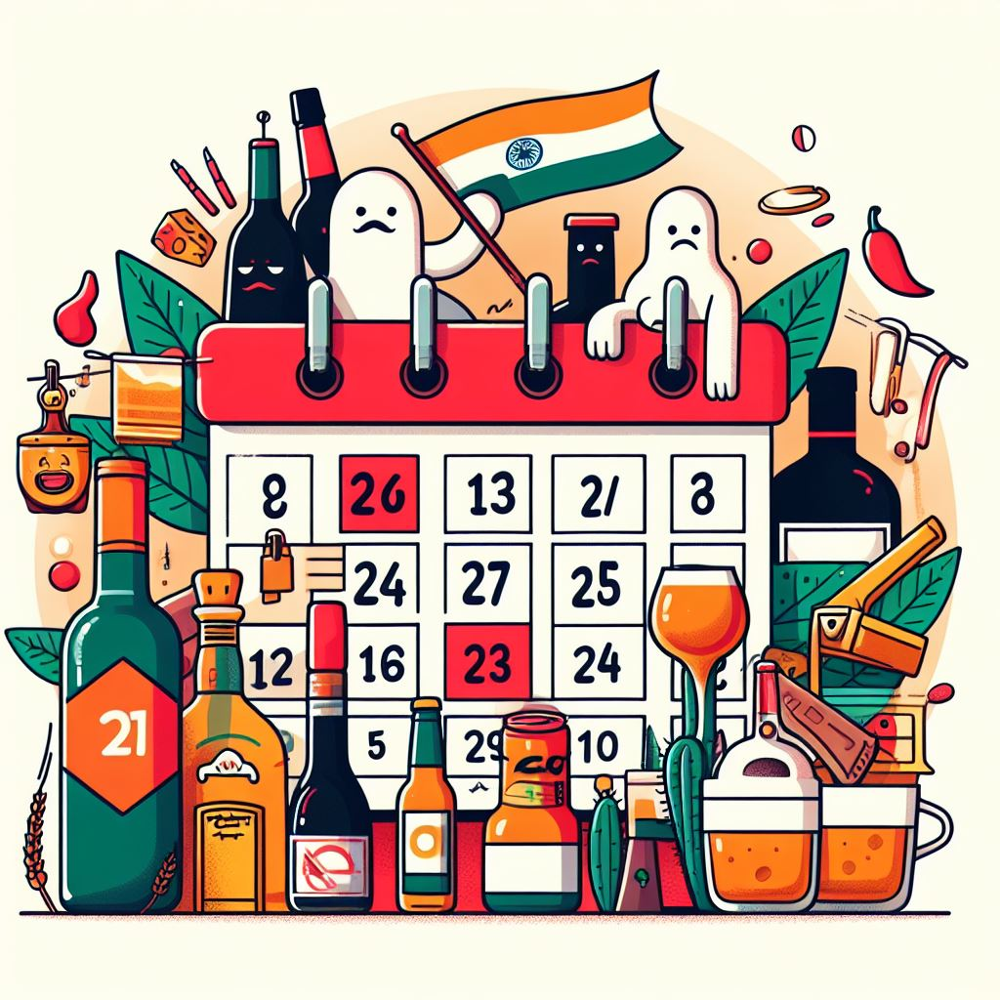

{{}}
\
Every state and union territory in India defines its own excise policy every year. Apart from a complex web of rules[^1] about manufacturing, retailing, and serving alcohol there’s something that is peculiarly Indian: dry days. The days on which alcohol cannot be sold.

In the state of Goa Gandhi Jayanti is the only dry day, whereas Haryana also includes Republic Day and Independence Day in the list. Sale of alcohol is also prohibited during elections: doesn’t matter whether it’s panchayat elections or general elections.

What exactly is the argument for having dry days? Well 2nd October is the easiest to explain as Gandhi was a staunch opponent of alcohol: "If I was appointed dictator for one hour for all India, the first thing I would do would be to close without compensation all the liquor shops, destroy all the toddy palms…"[^2]

And he’s well regarded in the country.

But what about other days? Apparently it’s a law and order situation. People get drunk and do drunk people things like [biting a crew member on a flight](https://timesofindia.indiatimes.com/world/rest-of-world/usbound-plane-returns-to-tokyo-after-drunk-passenger-bites-crew-member-latest-news/articleshow/106928301.cms). So you don’t want people to get drunk and create ruckus on important days like Independence Day when there will be public gatherings everywhere. This is flawed logic. Nothing is preventing the same hooligans from stocking up on the previous day. This also gives bad actors the incentive to sell bootleg alcohol and the retailers to sell illegally. So why not get rid of dry days altogether? People who want to abstain can do so out of their own volition and those who want to indulge are free to buy whatever they fancy.

The same argument can be made for dry days during elections. It’s argued that alcohol is used to bribe voters. What’s preventing an election candidate from buying alcohol in bulk one month before the elections and distributing it a day before the voting day?

There’s another point to be made about economic freedom. If a business is willing to sell me a legally produced product, in compliance with all the rules and regulations set by the government and is paying their taxes, and I’m willing to buy the product, then why should the government decide when I am allowed to buy it? It’s anyway better for them, I’m paying tax that’ll directly go to their coffers.

This is a clear case of the government treating the citizens as kids. The state is almighty and you’re but a meager human who can’t decide what’s good for you. Here’s your milk bottle. Don’t eat sand.

But there’s hope. According to [this](https://timesofindia.indiatimes.com/delhi-times/why-must-delhi-have-dry-days/articleshow/668982.cms?from=mdr) article there were 47(!) dry days in 1998 in Delhi. This number is coming down slowly. One day it will be zero and it can't come soon enough.

[^1]: The area of tavern at ground floor shall be covered with roof. The space shall not be ordinarily visible to the passersby and the access to such a space should be through a well-defined entry. The overall objective is to prevent drinking in public in full view of the passersby -- [Haryana Excise Policy, 2023-24](https://haryanatax.gov.in/HEX/DownloadPDF?formName=/ExcisePolicy2023_24/Excise_Policy_2023_24_001.pdf). The unimaginable horror of outdoor seating!

[^2]: Prohibition At Any Cost, 1960.
